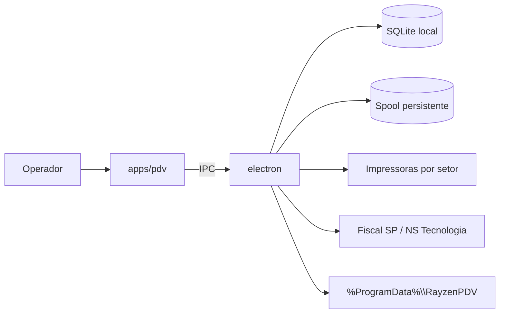

# Rayzen PDV

> Data de referencia deste conjunto de docs: 2026-03-12 (America/Sao_Paulo)

Rayzen PDV e um PDV desktop offline-first para bares e restaurantes, com Electron no desktop, SQLite local, IPC como caminho interno padrao e foco em auditoria de operacoes criticas.

## Estado atual

O repositorio ja contem a implementacao principal do baseline MVP:

- monorepo em `pnpm` workspaces, Node.js 22 LTS e TypeScript estrito
- `apps/pdv` com shell desktop teclado-first, autenticacao local por PIN, navegacao principal, interface operacional de comanda e fluxo operacional de caixa
- `packages/db` com SQLite local, migrations versionadas, auditoria, spool persistente, fila fiscal e repositorios transacionais
- `electron` com processo principal, preload seguro, IPC, paths em `%ProgramData%\\RayzenPDV`, logs exportaveis, backup/restore, spool de impressao, trilha fiscal SP e empacotamento Windows
- trilha fiscal inicial para Sao Paulo com NFC-e modelo 65, provider `NS_TECNOLOGIA`, contingencia `tpEmis=9` e segredos locais protegidos por DPAPI via `safeStorage`
- build e rollout manual para Windows com Electron Forge, tentativa de instalador Squirrel, ZIP de fallback e manifesto local de release

Gaps ainda abertos no estado atual:

- `pnpm lint` continua placeholder
- o roundtrip principal de comanda e caixa ja passa por IPC real e persistencia local no SQLite para abertura, itens, envio para producao, checkout, movimentos essenciais de caixa e fechamento
- o dominio de caixa ja expone por IPC abertura, status, sangria, suprimento, fechamento e resumo operacional
- autenticacao local por PIN e catalogo operacional ja saem de persistencia real no SQLite; o renderer apenas consome IPC
- o spool operacional de impressao ja nasce do envio persistido para producao, usa worker no processo principal e roteamento por setor salvo no SQLite
- o checkout da comanda ja pode enfileirar NFC-e automaticamente quando houver emitente fiscal habilitado no terminal; a emissao segue por fila persistente no processo principal
- o target de instalador Windows via Squirrel existe, mas ainda nao e o artefato padrao homologado neste host

## Objetivos do projeto

- Operar sem depender de internet para fluxos criticos.
- Tolerar falhas de rede, energia, impressao e travamentos.
- Garantir auditoria e rastreabilidade de operacoes sensiveis.
- Manter identidade visual, copy e artefatos originais do Rayzen PDV.

## Visao geral da arquitetura



## Layout do repositorio

```text
apps/pdv/      renderer e fluxos operacionais
packages/ui/   tokens e utilitarios visuais compartilhados
packages/db/   SQLite, migrations, repositorios e tipos de persistencia
electron/      processo principal, preload, impressao, fiscal e packaging
docs/          arquitetura, dominio, deployment, seguranca e runbooks
```

## Quickstart

### Pre-requisitos

- Node.js 22 LTS
- pnpm 10.x
- Windows 10/11 x64 para validar packaging e integracoes de campo

### Instalacao

```bash
pnpm install
```

### Desenvolvimento

```bash
pnpm dev
```

`pnpm dev` mantem o workspace em watch TypeScript. O baseline atual nao sobe servidor local nem API HTTP em loopback; o renderer conversa com o processo principal por IPC.

### Validacoes basicas

```bash
pnpm typecheck
pnpm build
pnpm test
```

Cobertura atual de validacao:

- `packages/db`: migrations, auditoria, spool, caixa e fila fiscal
- `electron`: paths, logs, backup/restore, spool, fiscal e packaging baseline
- `apps/pdv`: shell, atalhos, comanda e caixa em modo operacional local

### QA e regressao

```bash
pnpm test:unit
pnpm test:integration
pnpm test:smoke:offline
pnpm test:smoke:install
pnpm test:validate:printing
pnpm test:validate:cash
pnpm qa:homolog
pnpm qa:pilot
```

O baseline de QA atual usa Jest para suites unitarias e integradas, runners operacionais para smoke offline, impressao e caixa, e gera relatorios em `docs/qa/`.

### Empacotamento Windows

```bash
pnpm make:win
pnpm make:installer:win
pnpm release:manual
```

Comportamento atual:

- `pnpm make:win` gera o artefato ZIP bruto em `electron/out/make/`
- `pnpm make:installer:win` tenta gerar o instalador Windows pelo maker Squirrel
- `pnpm release:manual` roda build, smoke de instalacao, tenta o instalador e sempre consolida o ZIP de fallback em `electron/out/releases/vX.Y.Z/windows/` com `manual-rollout-manifest.json`
- quando o instalador nao sair no host de release, o ZIP continua sendo o artefato minimo obrigatorio para rollout manual
- auto-update permanece desabilitado

### Runtime local

O app usa `%ProgramData%\\RayzenPDV\\` como raiz operacional no Windows. Ali ficam banco, logs, spool, backups e artefatos fiscais locais.

O baseline atual tambem expone `backup.criar`, `backup.listar` e `backup.restaurar` por IPC, com restore validado por manifesto e `integrity_check` do SQLite antes do reinicio obrigatorio.

### First-run local

No primeiro boot do terminal, o renderer abre um wizard de first-run antes do login e grava a configuracao operacional em `%ProgramData%\\RayzenPDV\\config\\runtime-config.json`.

Quando o banco esta vazio, o processo principal aplica seed inicial via `packages/db`:

- operador `ADMIN`, role `GERENTE`, PIN inicial `1234`
- produtos `Hamburguer`, `Batata frita`, `Refrigerante` e `Cerveja`
- rotas base `COZINHA`, `BAR` e `CAIXA`

O wizard conclui:

- identificacao local da empresa
- revisao das impressoras de `COZINHA`, `BAR` e `CAIXA`
- persistencia da configuracao operacional fora dos segredos fiscais

Smoke automatizado dessa trilha:

```bash
pnpm test:smoke:install
```

O PIN nao fica em texto puro no SQLite; o MVP persiste apenas `pin_hash`.

## Documentacao

- [Arquitetura](docs/ARCHITECTURE.md)
- [Requisitos de Produto](docs/PRODUCT_REQUIREMENTS.md)
- [Dominio](docs/DOMAIN.md)
- [Decisoes Tecnicas](docs/TECH_DECISIONS.md)
- [Deployment](docs/DEPLOYMENT.md)
- [Matriz Operacional](docs/OPERATIONS_MATRIX.md)
- [Runbooks](docs/RUNBOOKS/installation.md)
- [Homologacao e Instalacao](docs/RUNBOOKS/homologation-installation.md)
- [Pacote de Validacao para Cliente](docs/RUNBOOKS/client-validation-package.md)
- [Piloto Assistido](docs/RUNBOOKS/pilot-operation.md)
- [QA](docs/qa/release-report.md)
- [Smoke Offline](docs/qa/smoke-offline.md)
- [Matriz de Regressao](docs/qa/test-matrix.md)
- [Checklist de Implantacao](docs/qa/pilot-deployment-checklist.md)
- [Onboarding Fiscal SP](docs/RUNBOOKS/fiscal-onboarding-sp.md)
- [Fiscal](docs/fiscal/README.md)
- [Seguranca e Privacidade](docs/SECURITY_PRIVACY.md)
- [ERD](docs/ERD.md)
- [OpenAPI](docs/openapi/README.md)

## Guardrails legais e de IP

- Nao copiar identidade visual, textos, icones, screenshots ou assets de terceiros.
- Nao manter referencias a concorrentes no repositorio.
- Usar apenas design system e copy proprios do Rayzen PDV.

## Contribuicao

Veja [CONTRIBUTING.md](CONTRIBUTING.md).
