# ERD - Rayzen PDV

Este documento resume o modelo de dados atual implementado em `packages/db`.

## Escopo atual

O schema local cobre:

- operadores locais, sessao de terminal e catalogo operacional
- auditoria append-only
- comanda, itens, pagamentos e snapshots de pre-conta
- sessao de caixa e movimentos por forma
- spool persistente de impressao por setor
- emitentes fiscais, documentos, eventos e fila fiscal
- controle de migrations

Itens ainda fora do banco no baseline atual:

- matriz final de configuracao de impressoras homologadas

## ERD em Mermaid

```mermaid
erDiagram
  SCHEMA_MIGRATIONS {
    string version PK
    string name
    datetime applied_at
  }

  AUDIT_EVENTS {
    string event_id PK
    string entity
    string entity_id
    string action
    string actor_user_id
    string actor_terminal_id
    string actor_role
    datetime occurred_at
  }

  OPERATORS {
    string operator_id PK
    string operator_code
    string nome
    string pin_hash
    string role
    boolean ativo
  }

  OPERATOR_SESSIONS {
    string terminal_id PK
    string operator_id FK
    datetime login_at
    datetime updated_at
  }

  PRODUCTS {
    string product_id PK
    string nome
    number preco_cents
    string categoria
    string setor
    string shortcut_hint
    boolean ativo
  }

  PRINT_SECTOR_ROUTING {
    string setor PK
    string printer_name
  }

  COMANDAS {
    string comanda_id PK
    string numero
    string mesa_id
    string status
    string current_owner_user_id
    datetime opened_at
    datetime closed_at
    datetime cancelled_at
  }

  COMANDA_ITEMS {
    string item_id PK
    string comanda_id FK
    string produto_id
    string product_label
    string setor
    number quantity
    number unit_price_cents
    string status
    string production_batch_id
  }

  COMANDA_PAYMENTS {
    string payment_id PK
    string comanda_id FK
    string method
    number amount_cents
    number change_amount_cents
    datetime paid_at
  }

  COMANDA_PRECONTAS {
    string pre_conta_id PK
    string comanda_id FK
    int version
    number total_amount_cents
    datetime generated_at
  }

  CASH_SESSIONS {
    string cash_session_id PK
    string terminal_id
    string opened_by_user_id
    string status
    datetime opened_at
    datetime closing_started_at
    datetime closed_at
  }

  CASH_MOVEMENTS {
    string cash_movement_id PK
    string cash_session_id FK
    string movement_type
    string payment_method
    number amount_cents
    string source_entity
    string source_entity_id
    datetime occurred_at
  }

  PRINT_JOBS {
    string print_job_id PK
    string source_entity
    string source_entity_id
    string setor
    string ticket_kind
    string status
    string printer_target_name
    int attempts
    string second_copy_of_job_id
    datetime next_retry_at
  }

  FISCAL_EMITTERS {
    string emitter_id PK
    string provider
    string environment
    string state_code
    string document_model
    string legal_name
    string cnpj
    string status
  }

  FISCAL_DOCUMENTS {
    string fiscal_doc_id PK
    string emitter_id FK
    string terminal_id
    string reference_type
    string reference_id
    string serie
    int numero
    string status
    string emission_mode
    string access_key
  }

  FISCAL_DOCUMENT_EVENTS {
    string fiscal_event_id PK
    string fiscal_doc_id FK
    string emitter_id FK
    string event_type
    string status
    datetime occurred_at
  }

  FISCAL_QUEUE {
    string fiscal_queue_id PK
    string fiscal_doc_id FK
    string emitter_id FK
    string terminal_id
    string status
    string emission_mode
    int attempts
    datetime next_retry_at
  }

  COMANDAS ||--o{ COMANDA_ITEMS : contem
  COMANDAS ||--o{ COMANDA_PAYMENTS : recebe
  COMANDAS ||--o{ COMANDA_PRECONTAS : gera
  OPERATORS ||--o{ OPERATOR_SESSIONS : autentica
  PRINT_SECTOR_ROUTING ||--o{ PRINT_JOBS : roteia
  CASH_SESSIONS ||--o{ CASH_MOVEMENTS : registra
  FISCAL_EMITTERS ||--o{ FISCAL_DOCUMENTS : emite
  FISCAL_EMITTERS ||--o{ FISCAL_DOCUMENT_EVENTS : origina
  FISCAL_EMITTERS ||--o{ FISCAL_QUEUE : processa
  FISCAL_DOCUMENTS ||--o{ FISCAL_DOCUMENT_EVENTS : registra
  FISCAL_DOCUMENTS ||--|| FISCAL_QUEUE : enfileira
```

## Convencoes atuais

- IDs tecnicos estaveis em texto
- trilhas criticas em `audit_events` e nos eventos fiscais dedicados
- migrations separadas em `up.sql` e `down.sql`
- spool e fila fiscal persistidos localmente
- segredos fiscais fora do banco, protegidos localmente por DPAPI via `safeStorage`
- seed inicial so roda quando `operators` e `products` estao vazios
